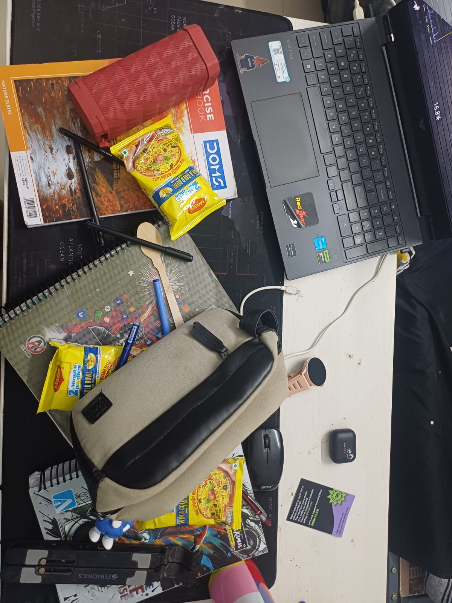

# Computer Vision Assignment — Multi-Instance MAGGI Detection

**Student:** Prakhar Chauhan  
**Roll Number:** B23BB1032  
**Course:** Computer Vision  

## Input Images

### Template Image

The isolated MAGGI packet used as the template for feature extraction and matching.

### Query Image

The cluttered query image containing multiple MAGGI packet instances.

